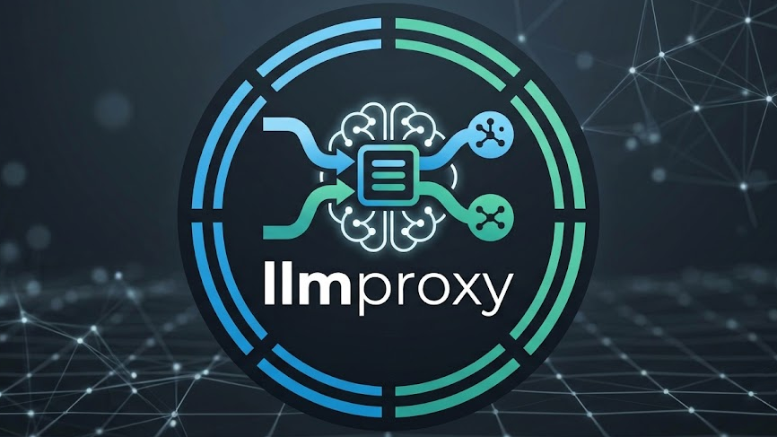
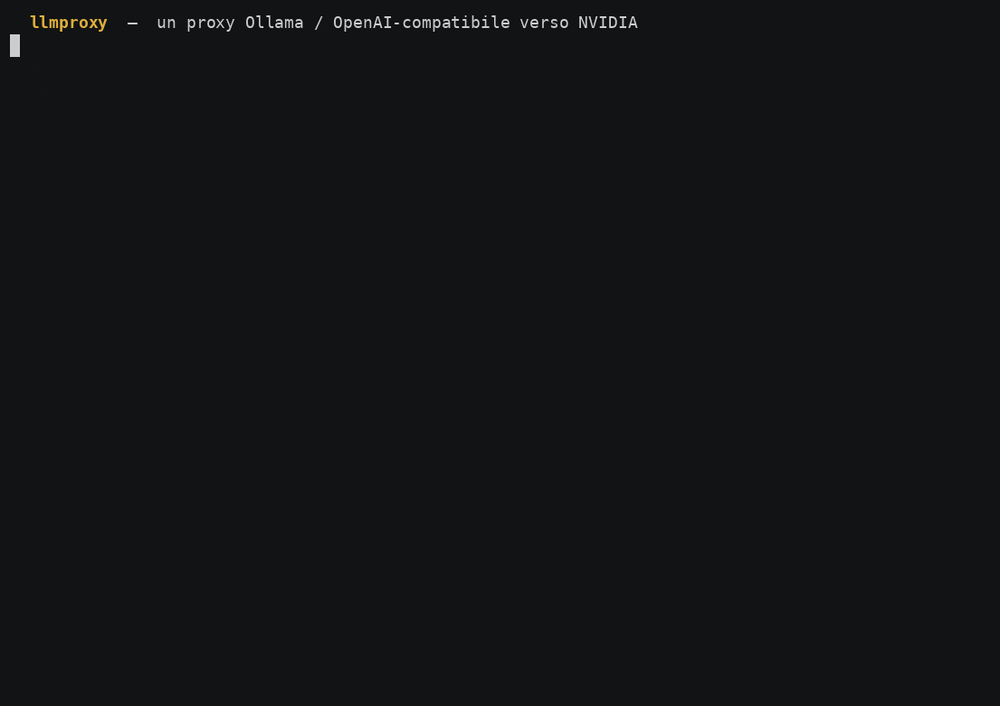
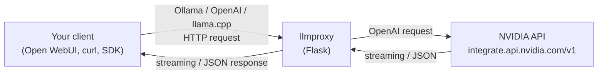

<p align="center">
  
</p>

# llmproxy
[](LICENSE)
[](https://github.com/lordraw77/llmproxy/stargazers)
[](https://github.com/lordraw77/llmproxy/issues)
[](https://hub.docker.com/r/lordraw/llmproxy)

**A lightweight, high-performance LLM proxy for caching, automatic failover, cost tracking, and seamless integration between local and cloud AI providers.**

**llmproxy** is a lightweight Flask server that emulates the HTTP APIs of several
popular local LLM runtimes ([Ollama](https://ollama.com), the
[OpenAI](https://platform.openai.com) `/v1` API, and
[llama.cpp](https://github.com/ggerganov/llama.cpp)'s `llama-server`) and
transparently **forwards every request to NVIDIA's OpenAI-compatible API**
(`https://integrate.api.nvidia.com/v1`).

This lets any tool that already speaks Ollama, OpenAI, or llama.cpp talk to a
NVIDIA-hosted model **without any client-side changes** — you simply point the
client at llmproxy instead of at a real local runtime. It covers chat,
completions, and **embeddings**, supports streaming, multi-model discovery,
optional inbound authentication, automatic retries on transient upstream errors,
an optional **response cache** (configurable TTL & size) for non-streaming
replies, and a live **`/stats`** metrics & process dashboard.

## Demo

<p align="center">
  
</p>

> The proxy starts, exposes the models, and answers both an OpenAI-compatible
> `/v1/chat/completions` call and a native Ollama streaming `/api/chat` call —
> every request forwarded to NVIDIA. The recording is scripted in
> [`scripts/demo.sh`](scripts/demo.sh) (source cast: [`assets/demo.cast`](assets/demo.cast)).



## Documentation index

| Document | Description |
|----------|-------------|
| [Overview](docs/overview.md) | What llmproxy is, how it works, and its architecture |
| [Installation](docs/installation.md) | Local and Docker setup instructions |
| [Configuration](docs/configuration.md) | Environment variables and options |
| [Logging & Telemetry](docs/logging.md) | Request/response logs, telemetry, and the configurable-timezone clock |
| [API Reference](docs/api-reference.md) | Every endpoint, with request/response examples |
| [Usage Examples](docs/usage.md) | End-to-end examples with curl and common clients |
| [Testing](docs/testing.md) | The `scripts/tests.sh` runner (bash + optional TUI) |
| [Deployment](docs/deployment.md) | Running in production with Docker Compose |
| [Troubleshooting](docs/troubleshooting.md) | Common problems and how to solve them |

## Quick start

```bash
# 1. Configure your NVIDIA API key
cp .env.example .env
# edit .env and set NVIDIA_API_KEY

# 2. Run with Docker Compose (or the prebuilt image)
docker compose up -d
# or: docker run -d -p 11434:11434 --env-file .env lordraw/llmproxy:latest

# 3. Test it
curl http://localhost:11434/
# → "Ollama is running"
```

The prebuilt image is published on Docker Hub as
[`lordraw/llmproxy`](https://hub.docker.com/r/lordraw/llmproxy); see
[Deployment](docs/deployment.md) for building and publishing with the `Makefile`.

## License

Released under the **MIT License** — see the [`LICENSE`](LICENSE) file for the
full text. In short: free to use, copy, modify, and distribute, with attribution
and no warranty.
